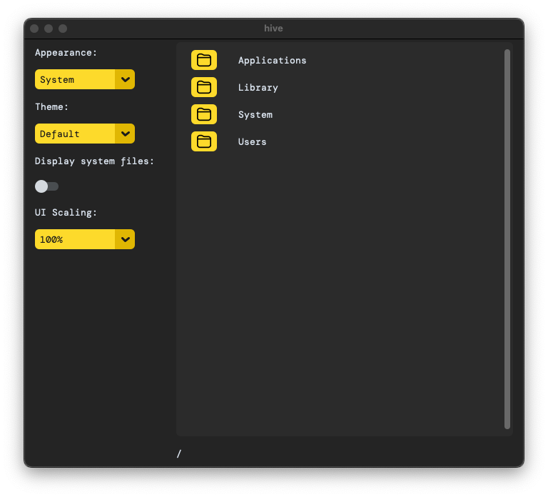
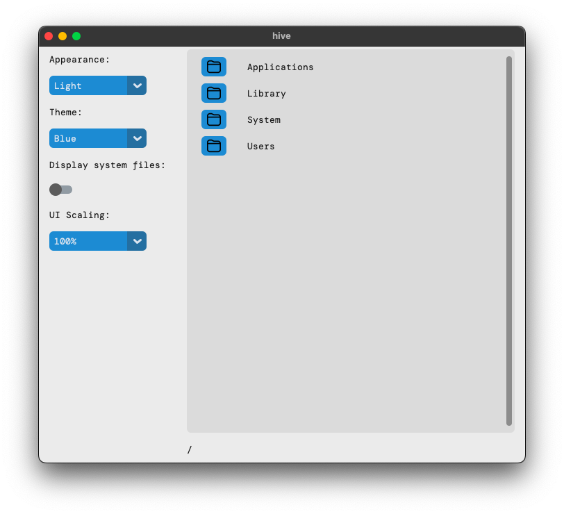
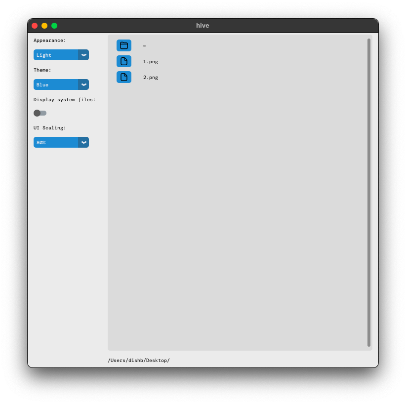
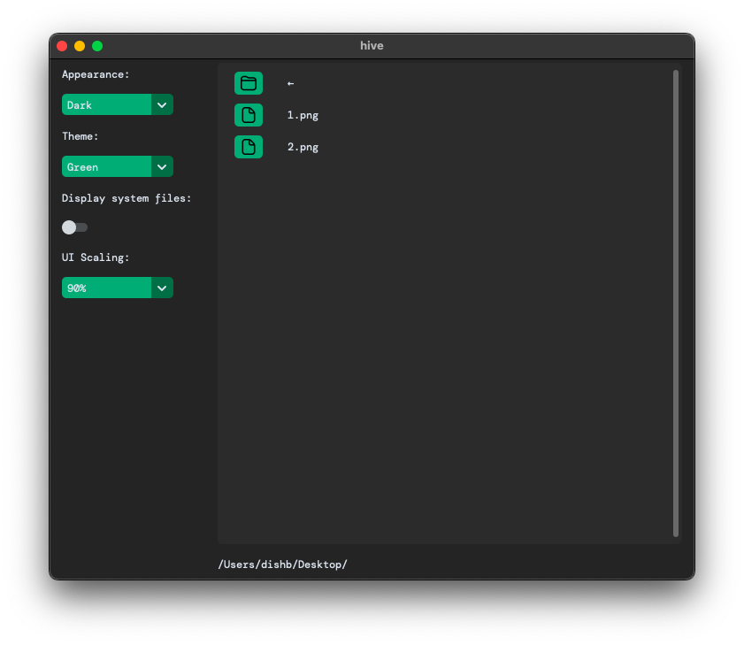

<!--
    A whole new file explorer for macOS. Finder, but better.
    Copyright (C) 2023  Dishant B. (@dishb) <code.dishb@gmail.com> and contributors.

    This program is free software: you can redistribute it and/or modify
    it under the terms of the GNU General Public License as published by
    the Free Software Foundation, either version 3 of the License, or
    (at your option) any later version.

    This program is distributed in the hope that it will be useful,
    but WITHOUT ANY WARRANTY; without even the implied warranty of
    MERCHANTABILITY or FITNESS FOR A PARTICULAR PURPOSE.  See the
    GNU General Public License for more details.

    You should have received a copy of the GNU General Public License
    along with this program.  If not, see <https://www.gnu.org/licenses/>.
-->

<div align = 'center'>
    <h1>hive</h1>
    A whole new file explorer for macOS. Finder, but better.
</div>

## About:
`hive` is a file explorer for macOS. At its core, `hive` is pure Python and uses the `customtkinter` module. This project is meant to be a simple file explorer with a clean and modern UI. While it's not as good as Finder yet, `hive` is meant to be a replacement for the somewhat dull, complex Finder. Users will be able to do everything they can in Finder, just without the clutter and extra nonsense. `hive` is targeted at casual users. People who don't need to harvest the full power of the operating system and file system. 

By being open source, `hive` can establish a community of users that can help contribute to the project through code, documentation, and more. The community can look at the internal workings of this tool and find potential issues. Suggestions can be made and development sped up. Open source allows this project to have a much higher chance of surviving and not dying out.

## Images:





## Download:
You can find the most recent build in the [Releases section](https://github.com/dishb/hive/releases) of this repository. Each release contains details as well as a version number.

## Build:
If you want to build `hive` from source yourself, follow the commands and instructions listed below.

If you haven't already, install the latest version of Python from the [official website](https://python.org/downloads/).
```bash
# create a folder for the repo, clone it
mkdir ./hive/
git clone https://github.com/dishb/hive.git ./hive/
cd ./hive/

# create a virtual environment and activiate it
python3 -m venv ./venv/
source ./venv/bin/activate

# upgrade pip and install dependencies
pip3 install --upgrade pip
pip3 install -r requirements.txt

# run the build script
python3 ./utility/build.py
```
The build can be found in your `/Applications/` folder. It will be a macOS application with the name `hive.app`.

## Contributing:
First off, thank you for showing interest in contributing to this open-source project! As mentiomed in the `About` section, this project depends on contributors to keep it alive. To keep `hive` maintainable, we have a few requirements.
- Please make sure your code runs without issue on `pylint`.
- When making commits, please follow this [style guide](https://github.com/dishb/commit-styles).
- Please use v3.11.3 as the minimum version of Python.
- Your tab size should be 4 spaces; not hard tabs
- The file encoding should be UTF-8

To get started with development, follow the commands listed below:
```bash
# create a folder for the repo, clone it
mkdir ./hive/
git clone https://github.com/dishb/hive.git ./hive/
cd ./hive/

# create a virtual environment and activiate it
python3 -m venv ./venv/
source ./venv/bin/activate

# upgrade pip and install dependencies
pip3 install --upgrade pip
pip3 install -r requirements.txt

# update our local customtkinter version
python3 ./utility/ctk_update.py
```
To lint your code with `pylint`, run the following commands from the top-level directory of the repository:
```bash
pylint $(git ls-files '*.py') --rcfile=.pylintrc
```

## Security:
If you find a security issue or vulnerability, please follow the instructions listed [here](./SECURITY.md) on in the `./SECURITY.md`  file.

## Code of Conduct:
To keep this repository friendly and open to everyone, please ensure that you follow the guidelines [here](./CODE_OF_CONDUCT.md) or in the `./CODE_OF_CONDUCT.md` file.

## License:
This project is licensed under the `GNU General Public License v3` license. A copy of the license can be found in [here](./LICENSE.md) or in the `./LICENSE.md` file. All the source code files have a license header at the top.
